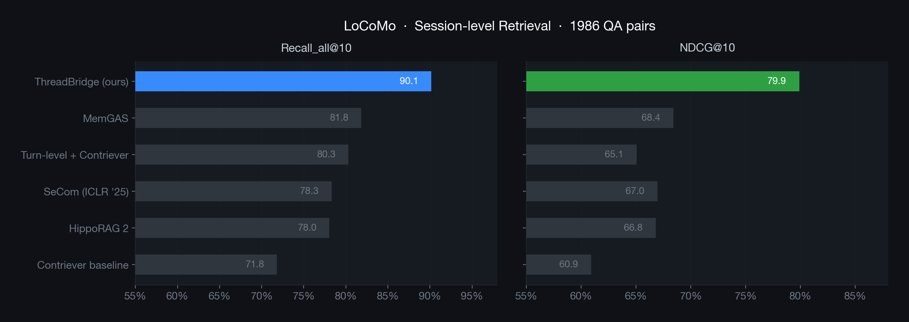
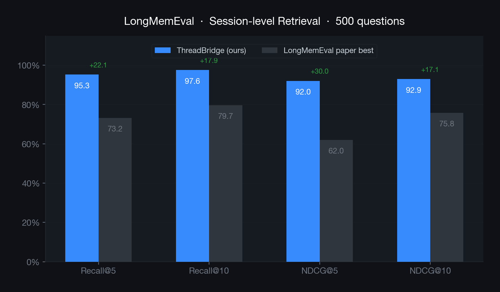
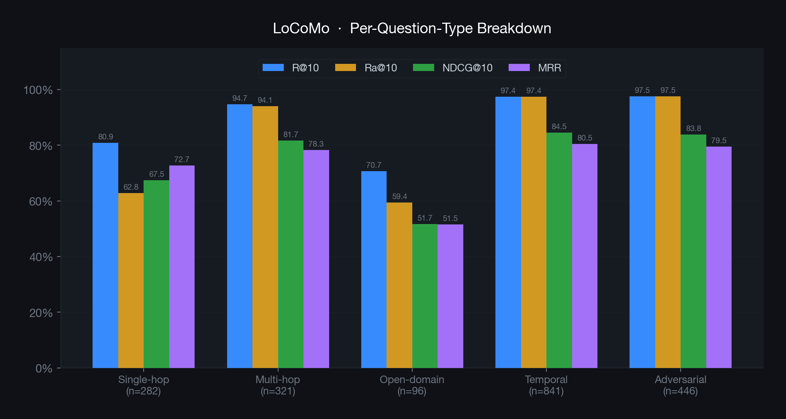

# ThreadBridge MCP Server for Zed

A [Zed](https://zed.dev) extension that provides persistent AI memory through the [Model Context Protocol](https://modelcontextprotocol.io/).

ThreadBridge remembers context across conversations using hybrid semantic search (Arctic Embed + BM25 + RRF) with a cognitive decay model (BLL).

## Retrieval Benchmark

Runs entirely on local CPU with zero cloud dependency.

**Config:** Arctic Embed M (768d) + BM25 hybrid + RRF fusion + BLL reranker (30%). Top-20, threshold 0.15.

### LoCoMo (Session-level, 1986 QA pairs)



### LongMemEval (Session-level, 500 questions)



### Per-question-type breakdown (LoCoMo)



### Metric definitions

- **Recall@K (fractional):** fraction of correct sessions retrieved in top-K unique sessions. Standard IR recall.
- **Recall_all@K (Ra@K):** binary — 1.0 iff *all* correct sessions are in top-K, else 0.0. Used by MemGAS for direct comparability.
- **NDCG@K:** normalized discounted cumulative gain at session level.
- **MRR:** mean reciprocal rank of first correct session.

### Notes

- LoCoMo dataset contains 10 conversations / 1986 QA pairs ([Maharana et al. 2024](https://github.com/snap-research/locomo)).
- Baseline numbers from [MemGAS Table 2&3](https://arxiv.org/abs/2505.19549) (recall_all definition confirmed via [source code](https://github.com/quqxui/MemGAS/blob/main/src/retrieval/eval_utils.py)).
- LongMemEval baseline from [Table 2&3](https://arxiv.org/abs/2410.10813) (ICLR 2025), using Stella V5 + dense retrieval.
- ThreadBridge reports **both** recall variants for transparency. The `Ra@10` column is directly comparable to MemGAS.
- End-to-end LLM-Judge scores (Hindsight, MemR3, Zep, Mem0) evaluate a different pipeline and are **not** comparable to retrieval-layer metrics.

## Installation

### From Extension Marketplace

1. Open Zed
2. Go to **Extensions** (cmd+shift+x)
3. Search for "ThreadBridge"
4. Click **Install**

ThreadBridge is now available in the Zed Extension Marketplace. The extension will automatically download the appropriate binary for your platform.

### Local Installation (Dev)

Dev extensions are compiled locally by Zed, so this installation method requires Rust via [rustup](https://www.rust-lang.org/tools/install). Rust is not required when installing ThreadBridge from the Zed Extension Marketplace.

1. Clone this repository:
   ```sh
   git clone https://github.com/dereklei12/zed-mcp-server-threadbridge.git
   ```

2. In Zed, open the command palette (cmd+shift+p) and run **zed: install dev extension**, then select the cloned directory.

3. The extension will automatically download the `mcp-threadbridge` binary from [GitHub Releases](https://github.com/dereklei12/mcp-threadbridge/releases) on first use.

## MCP Tools

| Tool | Description |
|------|-------------|
| `load_thread` | Load saved conversation context for a project |
| `save_thread` | Save current conversation context |
| `search_memory` | Semantic search across project memory |

## Configuration

Optional settings in Zed:

- `project_path` — project directory for memory storage (default: current working directory)
- `storage` — where to store thread data:
  - `"true"` (default): local, at `<project_path>/.threadbridge/`
  - `"false"`: global, at `~/.threadbridge/projects/`
  - absolute path: custom location

## Supported Platforms

- macOS (Apple Silicon)
- Linux (x86_64)
- Windows (x86_64)

## License

MIT
